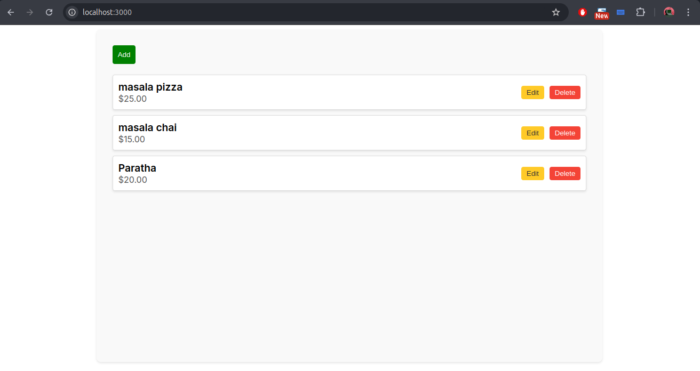
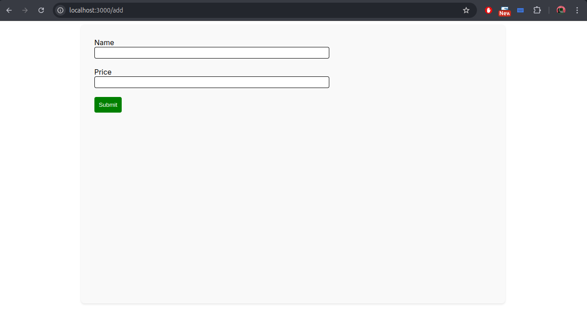

# Restaurant Menu Manager

This is a simple web application that allows users to add, delete, and edit the menu for a particular restaurant. The backend is built with Django, and the frontend is developed using Next.js. This project was created as a learning exercise and is part of my personal repositories.

## Screenshots




## Features

- **Add Menu Items:** Easily add new dishes to the restaurant's menu.
- **Edit Menu Items:** Update the details of existing menu items.
- **Delete Menu Items:** Remove items that are no longer available.

## Technologies Used

- **Backend:** Django
- **Frontend:** Next.js
- **Database:** SQLite

## Installation

1. **Clone the Repository:**

   ```bash
   git clone https://github.com/anand-jaiswal-IN/restaurant-django-next-app
   cd restaurant-django-next-app
   ```

2. **Backend Setup:**

   - Navigate to the backend directory:

     ```bash
     cd backend
     ```

   - Try to use virtual environment.

     ```bash
     virtualenv venv
     ```

   - Install the dependencies:

     ```bash
     pip install -r requirements.txt
     ```

   - Apply migrations:

     ```bash
     python3 manage.py migrate
     ```

   - Run the development server:

     ```bash
     python3 manage.py runserver
     ```

3. **Frontend Setup:**

   - Navigate to the frontend directory:

     ```bash
     cd ../frontend
     ```

   - Install the dependencies:

     ```bash
     npm install
     ```

   - Run the development server:

     ```bash
     npm run dev
     ```

4. **Access the Application:**

   - Open your browser and go to `http://localhost:3000` to view the app.
